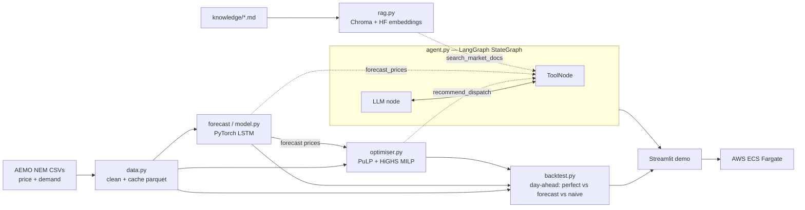
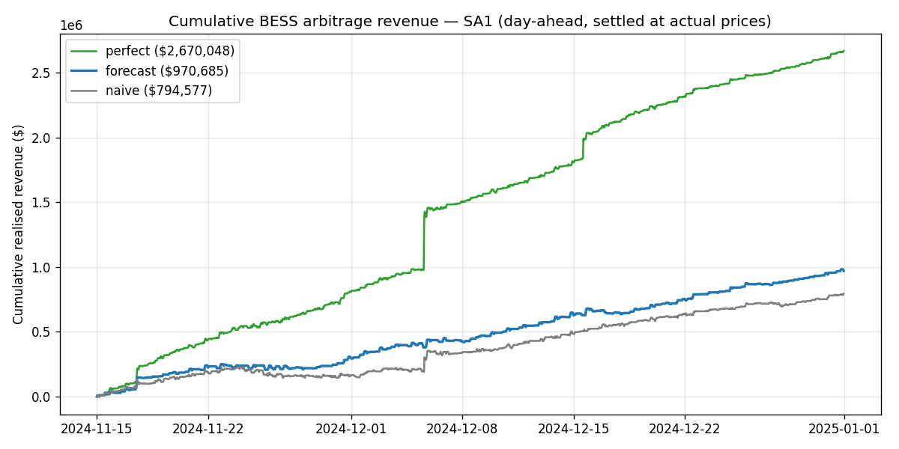

# 🔋 BESS Dispatch Optimiser & Advisor

Decide when a grid-scale battery should charge and discharge to maximise energy-
arbitrage revenue on the Australian National Electricity Market (NEM) — and ask a
natural-language agent to explain the plan and the market rules behind it.

Built end-to-end on **real AEMO price + demand data**:

- **MILP dispatch optimiser** (PuLP + HiGHS) — optimal charge/discharge against a
  price horizon, with round-trip losses, SoC limits, a charge/discharge mutex
  (the integer part), and a degradation cost.
- **PyTorch price forecaster** — a multi-horizon LSTM predicting the next 24 h of
  spot prices, evaluated leakage-free against a seasonal-naive baseline.
- **LangGraph agent** — a tool-calling `StateGraph` that answers questions by
  invoking the optimiser, the forecaster, and a document store.
- **Chroma RAG** — a vector store over NEM/BESS market docs (Hugging Face
  embeddings) so the agent **cites its sources** instead of freelancing rules.
- **AWS ECS Fargate** deploy — a public Streamlit demo from a single container.

## Architecture



## Headline result

Day-ahead backtest, SA1, ~6 weeks of held-out Nov–Dec 2024 data. Each policy commits
a daily schedule against its own price view, then is **settled at actual prices**:

| Policy | Realised arbitrage revenue | % of perfect foresight |
|---|--:|--:|
| Perfect foresight (upper bound) | $2,670,000 | 100.0% |
| **LSTM forecast-driven** | **$971,000** | **36.4%** |
| Seasonal-naive | $795,000 | 29.8% |



**The honest reading:** the LSTM earns **~22% more than the naive baseline**, but
captures only ~36% of the perfect-foresight ceiling. Almost all of perfect
foresight's lead comes from a handful of extreme price-spike days that no day-ahead
forecast can anticipate — visible as the step-jumps in the green line. This is the
real economics of price forecasting for storage, not a cherry-picked number.

Forecaster test metrics (leakage-free time-split): **MAE $61.5/MWh vs naive $66.5
(+7.5% skill); RMSE $164 vs $218 (−25%)** — the larger RMSE gain shows it handles
spikes meaningfully better than naive.

## Quickstart

```bash
uv venv --python 3.12 .venv
uv pip install --python .venv/Scripts/python.exe -e ".[ai,demo,dev]"

# Build artifacts (fetch a year of SA1, train, ingest docs, render money chart)
make artifacts            # or run the four scripts/ commands directly

pytest -q                 # optimiser invariants
streamlit run app/streamlit_app.py
```

Set `OPENAI_API_KEY` to enable the advisor agent (the optimiser, forecaster, and
backtest run without it).

## Deploy

The trained model, processed prices, and Chroma store (~2.6 MB total) are committed,
so the container is self-contained — no rebuild step on the host.

### Free — Google Cloud Run (recommended for a demo)

Scales to zero (no idle cost, stays in the free tier) and builds from source via
Cloud Build, so **no local Docker is needed**:

```bash
gcloud auth login
gcloud config set project YOUR_PROJECT_ID            # billing must be enabled
gcloud services enable run.googleapis.com cloudbuild.googleapis.com artifactregistry.googleapis.com
bash deploy/deploy-cloudrun.sh                        # prints the live URL
```

Deploys **without an OpenAI key** by default — the optimiser, forecast, money chart,
and RAG retrieval run live; the LLM advisor tab shows a notice. Uncomment the
`--set-secrets` block in the script to enable the agent later.

### AWS ECS Fargate

```bash
aws ssm put-parameter --name /bess/openai_api_key --type SecureString --value sk-...
cd deploy && ./deploy-ecs.sh        # builds, pushes to ECR, runs a Fargate service
```

See `deploy/deploy-ecs.sh` for the public-IP / cost notes (~A$50-60/mo if left on).

## Repo layout

```
src/bess/
  config.py      battery + market parameters (pydantic)
  data.py        AEMO loader + cache + synthetic fallback
  optimiser.py   MILP dispatch (PuLP + HiGHS)
  forecast.py    features, splits, windows, metrics, baselines  (torch-free)
  model.py       PyTorch LSTM + trainer  (anti-leakage scaling on train only)
  backtest.py    day-ahead receding-horizon evaluation
  rag.py         Chroma + sentence-transformers ingest/query
  agent.py       LangGraph StateGraph + tools
app/             Streamlit demo
scripts/         fetch_data, train_forecast, run_backtest
deploy/          ECS task definition + deploy script
docs/knowledge/  NEM/BESS market corpus for the RAG store
tests/           optimiser invariants
```

## Honest limitations

- Energy arbitrage only — no FCAS co-optimisation, so revenue **understates** a
  real battery's stacked return (see `docs/knowledge/fcas_and_revenue_stacking.md`).
- Prices are raw RRP; MLF, network charges, and connection costs aren't netted off.
- Day-ahead framing pins terminal SoC to the start each day (no multi-day shifting).
- One year, one region by default; the pipeline generalises to all five NEM regions.

## Tech

Python 3.12 · PuLP 2.9 + HiGHS · PyTorch 2.6 · scikit-learn · LangGraph 0.2 ·
LangChain · Chroma 0.5 · sentence-transformers (HF) · Streamlit · Docker · AWS ECS.
